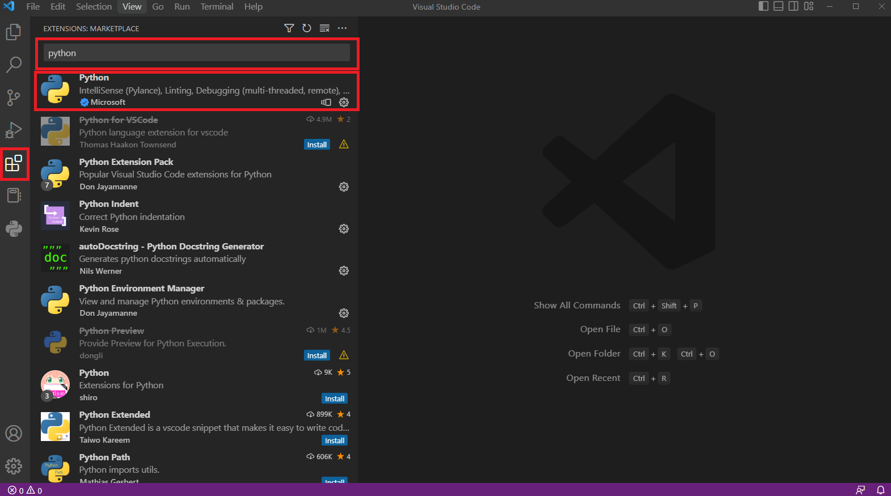
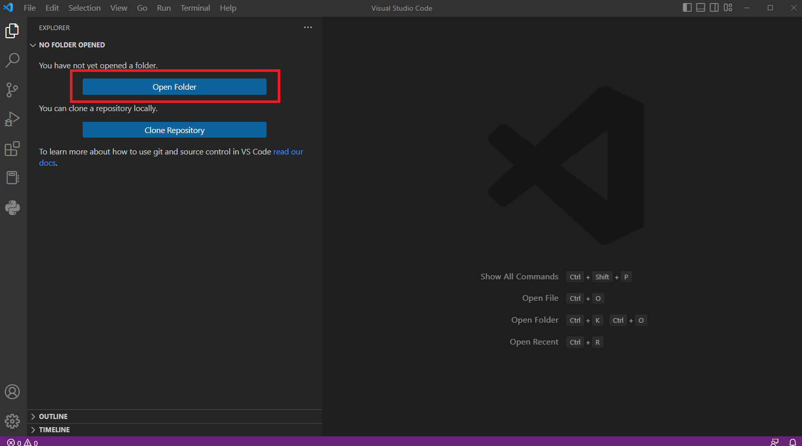

# 파이썬 개발 환경 설정하기


## Python 설치

- 파이썬을 설치하기 위해 [파이썬 공식홈페이지](https://www.python.org/downloads/) 사이트로 들어간다.
- 각자의 OS 환경에 맞는 python을 설치한다. 


## VScode 설치

- VScode를 설치하기 위해 [Visual Studio 공식홈페이지](https://code.visualstudio.com/download)로 들어간다.

- 각자의 OS 환경에 맞는 `VScode` 를 설치한다.


## VScode Extension 설치


- 설치된 vscode를 열어 extension 메뉴를 클릭한다.



  
## 개발 환경 설정 테스트

- Open Folder를 클릭하여 새로운 프로젝트를 생성할 폴더를 선택해 준다.




- .py 확장자의 파일을 새로 생성한다. 
- 간단한 테스트 코드를 작성한다. 


```
print('hello world')
```
