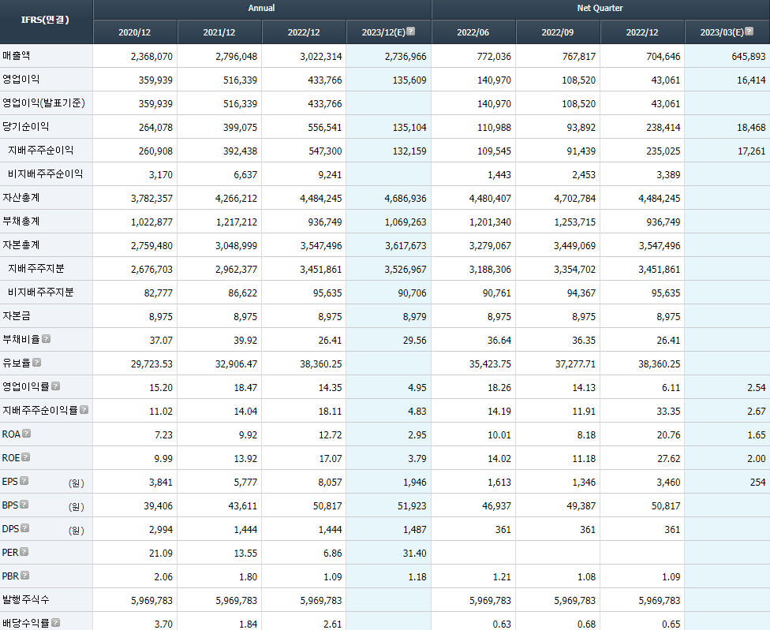
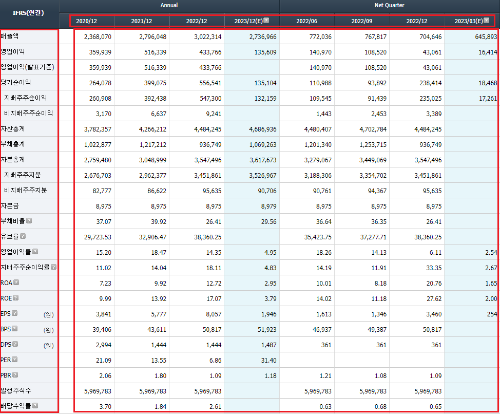

# Pandas와 Numpy를 활용한 재무 데이터 분석

## [fnguide](http://comp.fnguide.com/SVO2/ASP/SVD_main.asp?pGB=1&gicode=A005930&cID=&MenuYn=Y&ReportGB=&NewMenuID=11&stkGb=&strResearchYN=) 에 접속해 회사에 대한 재무 정보를 획득할 수 있다.


- Financial Highlight 표를 추출하기 위해 html를 분석한다.



- 가져와야 할 부분을 세 부분으로 나눈다. 




- 컨센서스 추청치를 활용하여 주당 순이익(EPS)가 증가하는 종목을 선정한다.

```
import requests
from bs4 import BeautifulSoup
import numpy as np
import pandas as pd


code = ['A005930', 'A373220','A009830']     # 분석하고자 하는 종목코드
company_eps = {}

for i in code:

    URL = "http://comp.fnguide.com/SVO2/ASP/SVD_main.asp?pGB=1&gicode="+i+"&cID=&MenuYn=Y&ReportGB=&NewMenuID=11&stkGb=&strResearchYN="  #fnguide에서 개별 종목 정보 획득

    company = requests.get(URL)
    html = company.text

    soup = BeautifulSoup(html, 'html.parser')

    finance_html = soup.select('#highlight_D_A > table > thead > tr.td_gapcolor2 > th > div')    # 재무정보 컬럼(날짜) 정보 추출

    # annual_date = finance_html[:4]
    # quarter_date = finance_html[4:]

    finance_date = [j.get_text().strip().split('\n')[-1] for j in finance_html]    # 날짜만 추출되도록 전처리

    print(finance_date)


    finance_html = soup.select('#highlight_D_A > table > tbody > tr > th > div')   # 재무 index 추출

    finance_index = [j.get_text().strip().split('(')[0] for j in finance_html]

    print(finance_index)


    finance_result_html = soup.select('#highlight_D_A > table > tbody > tr > td') # 재무 데이터 추출


    finance_result = [j.get_text().strip().replace(",","") for j in finance_result_html]


    finance_result = np.array(finance_result)    # 리스트로만 되어 있는 재무정보를 index 별로 정리하기 위해 numpy로 변경
    finance_result.resize(len(finance_index),8)  # numpy를 이용해 resizing

    finance = pd.DataFrame(data = finance_result[0:,0:], index=finance_index , columns= finance_date)   # 재무정보를 index, column 별로 pandas에 저장
    finance = finance.replace("",np.nan).astype('float')         # 재무정보가 문자열로 되어 있는 것을 분석을 위해 float형으로 변환
    print(finance)

    anuual_finace = finance.iloc[:, :4]        # 연간 실적
    quarter_finace = finance.iloc[:, 4:]       # 분기 실적

    # print(anuual_finace)

    anuual_finace_margin = anuual_finace.loc[['EPS','영업이익률'],:]    # EPS와 영업이익률 정보만을 추출
    anuual_finace_margin_change=anuual_finace_margin.pct_change(axis = "columns")  # EPS의 증감률을 구함  

   

    company_eps[i]=anuual_finace_margin_change.iloc[0,-1]  ## 최근 EPS 증감율 선정

    print(company_eps)

eps_series = pd.Series(data=company_eps)       # 회사의 EPS 증감률을 pandas series에 저장

print(eps_series.sort_values(ascending=False))  # 회사의 EPS 증감율이 큰 순서대로 데이터 정리

```


