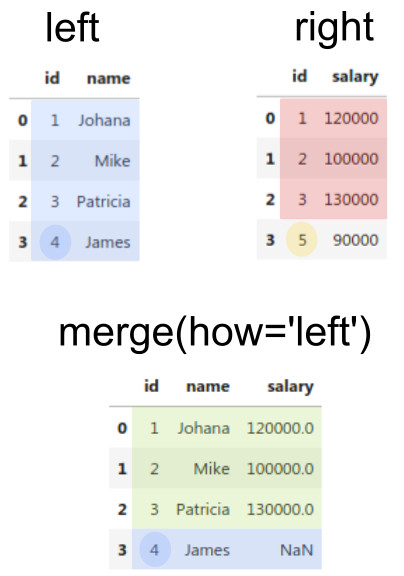

# 네이버 API를 활용한 검색 트랜드 시각화 하기

- 파이썬으로 데이터 시각화하기(https://wikidocs.net/92095)를 통해 다양한 데이터 시각화 방법을 참고한다.


## Naver Developers로 이동

- naver API 사용을 위해  [네이버 개발자 센터](https://developers.naver.com) 로 들어간다.
- 네이버에 로그인 후 데이터랩 API로 들어간다.


- Application 등록을 하여 API 이용신청을 한다.


- 내 애플리케이션에 등록된 `Client ID` 및 `Client Secret` 을 획득한다.


# api 테스트


- api test tool 이용 (postman 사용)
  * test tool 사용을 위해 [Postman](https://www.postman.com/downloads/) 로 들어간다.
  * Postman으로 api를 테스트한다.


- Headers 

```
X-Naver-Client-Id      발급받은 ID
X-Naver-Client-Secret  발급받은 secret key
Content-Type           application/json 
```

- Body

```
{
  "startDate": "2022-10-01",
  "endDate": "2022-12-31",
  "timeUnit": "date",
  "keywordGroups": [
    {
      "groupName": "한글",
      "keywords": [
        "한글",
        "Korean"
      ]
    },
    {
      "groupName": "영어",
      "keywords": [
        "영어",
        "english"
      ]
    }
  ]
 
}
```

## 시간 경과에 따른 사이버대 검색량 추이 시각화


- (참고 사이트 : https://wooiljeong.github.io/python/naver_datalab_open_api/ , https://datacomy.com/data_analysis/pandas/merge/)
- 네이버 데이터랩 오픈 API로 검색어 트랜드 데이터 수집
  * 특정 검색어들의 추이를 Json으로 반환하는 api
- 위의 절차대로 api를 테스트 후 api를 활용한 데이터 수집 절차를 진행한다.


- api를 활용한 트렌드 검색 수행

- dataframe의 merge 방법

  * merge 종류

     - 

  * 데이터의 예

     -  

  * inner join
     - 

  * outer join
     - 

  * left join
     - 
     
  * right join
     - 

```
import urllib.request
import json
import pandas as pd
from tabulate import tabulate

class Naver_trend_API():
    """
    네이버 데이터랩 오픈 API
    """

    def __init__(self, client_id, client_secret):
        """
        인증키 및 키워드 그룹 초기화
        """
        self.client_id = client_id
        self.client_secret = client_secret
        self.keywordGroups = []
        self.url = "https://openapi.naver.com/v1/datalab/search"
        
    def add_keyword_groups(self, group_dict):
        """
        검색어 그룹 추가
        """

        keyword_gorup = {
            'groupName': group_dict['groupName'],
            'keywords': group_dict['keywords']
        }
        
        self.keywordGroups.append(keyword_gorup)


    def get_data(self, startDate, endDate, timeUnit, device, ages, gender):
        """
        요청 결과 반환
        timeUnit - 'date', 'week', 'month'
        device - None, 'pc', 'mo'
        ages = [], ['1' ~ '11']
        gender = None, 'm', 'f'
        """

        # Request body
        body = json.dumps({
            "startDate": startDate,
            "endDate": endDate,
            "timeUnit": timeUnit,
            "keywordGroups": self.keywordGroups,
            "device": device,
            "ages": ages,
            "gender": gender
        }, ensure_ascii=False)
        
        # Results
        request = urllib.request.Request(self.url)
        request.add_header("X-Naver-Client-Id",self.client_id)
        request.add_header("X-Naver-Client-Secret",self.client_secret)
        request.add_header("Content-Type","application/json")
        response = urllib.request.urlopen(request, data=body.encode("utf-8"))
        rescode = response.getcode()
        if(rescode==200):
            # Json Result
            result = json.loads(response.read())
            
            df1 = pd.DataFrame(result['results'][0]['data'])
            df1=df1.rename(columns={'ratio': result['results'][0]['title']})
            df2 = pd.DataFrame(result['results'][1]['data'])
            df2=df2.rename(columns={'ratio': result['results'][1]['title']})
            df3 = pd.DataFrame(result['results'][2]['data'])
            df3=df3.rename(columns={'ratio': result['results'][2]['title']})
            
            
            df = pd.merge(df1, df2,how='left', on=['period'])
            df = pd.merge(df, df3,how='left', on=['period'])
                      
        else:
            print("Error Code:" + rescode)
        self.df = df    
        return self.df

    
keyword_group_set = {
    'keyword_group_1': {'groupName': "고려사이버대", 'keywords': ["고려사이버대","고려사이버대학교","고려사이버"]},
    'keyword_group_2': {'groupName': "한양사이버대", 'keywords': ["한양사이버대","한양사이버대학교","한양사이버"]},
    'keyword_group_3': {'groupName': "경희사이버대", 'keywords': ["경희사이버대","경희사이버대학교","경희사이버"]},

}


# API 인증 정보 설정
client_id = "DtxV5cxd43iCXUIOwv4h"
client_secret = "ErBqsqeU1V"

# 요청 파라미터 설정
startDate = "2022-10-01"
endDate = "2022-12-31"
timeUnit = 'date'
device = ''
ages = []
gender = ''

# 데이터 프레임 정의
naver = Naver_trend_API(client_id=client_id, client_secret=client_secret)

naver.add_keyword_groups(keyword_group_set['keyword_group_1'])
naver.add_keyword_groups(keyword_group_set['keyword_group_2'])
naver.add_keyword_groups(keyword_group_set['keyword_group_3'])

df = naver.get_data(startDate, endDate, timeUnit, device, ages, gender)

print(tabulate(df, headers ='keys',tablefmt ='psql'))

```


