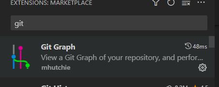

# Git으로 SW 형상 관리하기

## repository initialization

-   [GitHub](https://github.com/) 으로 들어가 회원가입을 한다.

- new repository 생성을 하여 원격 repository를 생성한다. 

- VScode에서 `git init`을 수행


## 코드 생성하기

- .py  파일을 생성하여 코드 입력

```
a = 10
b = 10

c = a+ b

print(c)

```

- 파일 저장


## git 변경내용 확정한 뒤 원격 repository에 push

- staging area로 넘기기 (git add)

```
git add hello.py
```


- commit

- 원격 저장소 주소 추가 

```
git remote add origin 원격저장소 주소
```

- 원격 저장소로 push

```
git push -u origin 브렌치 이름
```

## branch history를 그래프로 확인하기

- VScode 확장 프로그램으로 Git Graph 설치




## 새로운 branch 생성하기

- 새로운 branch 생성을 한다.

```
git branch 새로운 브랜치 이름
```

- 생성한 branch 목록 확인

```
git branch
```


## branch 전환하고 소스코드 수정

- 새로 생성한 브랜치 전환

```
git checkout 전환할 brach 이름
```

- 소스 코드 수정

```
a = 10
b = 10

c = a * b

print(c)
```

- 변경 내용 확정

```
git add hello.py
```

```
git commit -m "더하기를 곱하기로 수정"
```

- 원격 저장소에 반영

```
git push -u origin brach 이름
```

- oauth 방식이나, token 방식을 이용해 권한 인증


## branch 병합하기


- master branch로 전환후, branch 병합

```
git checkout master
git merge
```


## branch 충돌 해결하기

### 코드를 직접 수정하여 해결

- 충돌이 발생한 코드 라인을 직접 수정하여 하나로 통합

### 에디터를 사용하여 해결

- 충돌이 발생한 코드를 선택하여 결과 반영


## Commint 되돌아 가기

- git revert를 사용

```
git revert 취소하고자 하는 commit버전
```


