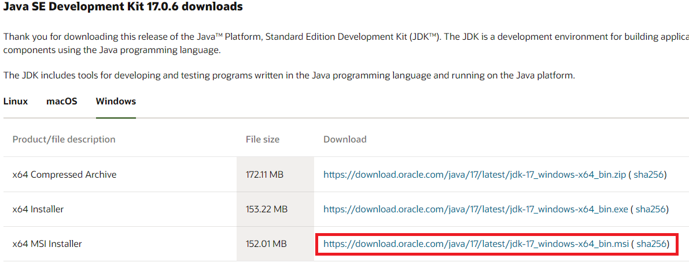
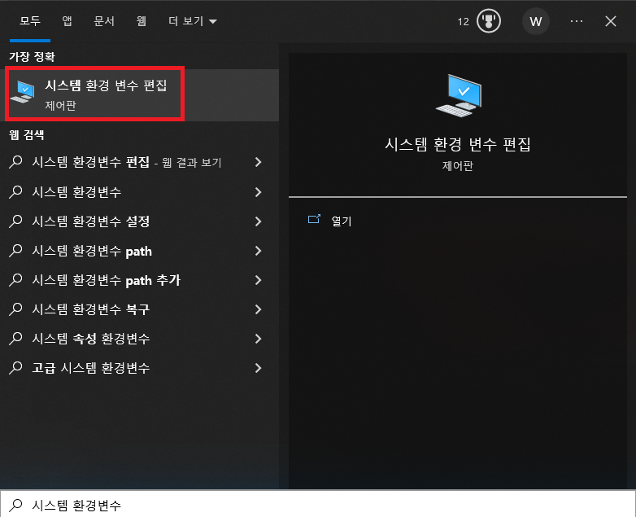
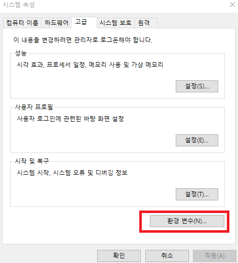
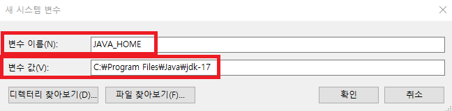

# 한국어 분석

## KoNLPy 설치

- Java 1.7+ 설치

 * Java를 설치하기 위해  [오라클 홈페이지](https://www.oracle.com/java/technologies/downloads/#jdk17-windows)에 접속하여, 설치파일을 다운로드 한다.



- Java 환경변수를 설정한다. 
 * 시스템 변수







- Java 설치 확인
 * Terminal에서 java -version 을 수행해 본다.

```
java -version


java version "17.0.6" 2023-01-17 LTS
Java(TM) SE Runtime Environment (build 17.0.6+9-LTS-190)
Java HotSpot(TM) 64-Bit Server VM (build 17.0.6+9-LTS-190, mixed mode, sharing)
```


- KoNLPy 패키지 설치

```
pip install konlpy jpype1
```

- KoNLPy 설치 테스트
 * 혹 오류가 난다면, VScode 를 재시작

 ```
from konlpy.tag import Okt
okt = Okt()
malist = okt.pos("아버지 가방에 들어가신다.", norm=True, stem=True)
print(malist)
 ```


## 형태소 분석을 기반으로 한 단어 출현 빈도 구하기

- 박경리 토지 소설에서 많이 등장한 단어 분석하기
  * 한글 자연어 처리를 위한 라이브러리인 '트위터'를 사용하여 주어진 텍스트 데이터에서 명사를 추출하고, 그 중에서 가장 빈도가 높은 50개의 명사를 추출한다.

```
import codecs
from bs4 import BeautifulSoup
from konlpy.tag import Twitter
import requests
# utf-16 인코딩으로 파일을 열고 글자를 출력하기 --- (※1)

URL = "https://cukykkim.github.io/toji/"  # 웹상에서 토지 소설의 일부를 불러오기

toji = requests.get(URL)
toji.encoding= "utf-16"
html = toji.text

soup = BeautifulSoup(html, 'html.parser')

body = soup.select_one("body > text")

text = body.get_text()

# 텍스트를 한 줄씩 처리하기 --- (※2)
twitter = Twitter()   #  트위터 객체를 생성
word_dic = {}      # 추출한 명사와 그 출현 빈도를 저장하기 위한 딕셔너리를 생성
lines = text.split("\n")
for line in lines:
    malist = twitter.pos(line)  # 텍스트 데이터의 각 줄에 대해 트위터 객체를 사용하여 형태소 분석을 수행
    for word in malist:
        if word[1] == "Noun": #  명사 확인하기 --- (※3)
            if not (word[0] in word_dic):
                word_dic[word[0]] = 0
            word_dic[word[0]] += 1 # 카운트하기
# 많이 사용된 명사 출력하기 --- (※4)
keys = sorted(word_dic.items(), key=lambda x:x[1], reverse=True) # 딕셔너리의 값을 기준으로 내림차순으로 정렬
for word, count in keys[:50]:
    print("{0}({1}) ".format(word, count), end="")
print()
```


## Gensim의 Word2Vec으로 단어 벡터화 하기

- Gensim 설치

```
pip install gensim
```

- Gensim의 word2vec으로 토지에 나오는 단어 벡터화 하기

```
import codecs
from bs4 import BeautifulSoup
from konlpy.tag import Twitter
from gensim.models import word2vec
# utf-16 인코딩으로 파일을 열고 글자를 출력하기 --- (※1)
fp = codecs.open("BEXX0003.txt", "r", encoding="utf-16")
soup = BeautifulSoup(fp, "html.parser")
body = soup.select_one("body > text")
text = body.getText()
# 텍스트를 한 줄씩 처리하기 --- (※2)
twitter = Twitter()
results = []
lines = text.split("\r\n")
for line in lines:
    # 형태소 분석하기 --- (※3)
    # 단어의 기본형 사용
    malist = twitter.pos(line, norm=True, stem=True)
    r = []
    for word in malist:
        # 어미/조사/구두점 등은 대상에서 제외 
        if not word[1] in ["Josa", "Eomi", "Punctuation"]:
            r.append(word[0])
    rl = (" ".join(r)).strip()
    results.append(rl)
    print(rl)
# 파일로 출력하기  --- (※4)
gubun_file = 'toji.gubun'
with open(gubun_file, 'w', encoding='utf-8') as fp:
    fp.write("\n".join(results))
# Word2Vec 모델 만들기 --- (※5)
data = word2vec.LineSentence(gubun_file)
model = word2vec.Word2Vec(data, 
    vector_size=200, window=10, hs=1, min_count=2, sg=1)
model.save("toji.model")
print("ok")
```

## 벡터화 된 단어들 확인


```
from gensim.models import word2vec
ko_model = gensim.models.Word2Vec.load('./model/ko/ko.bin')
a = ko_model.wv.most_similar("강아지")
print(a)
```