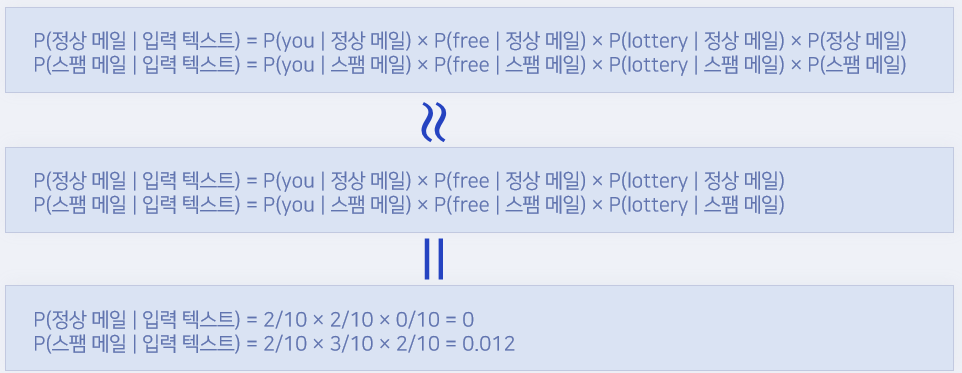

# 텍스트 분류

## 스팸 메일 분류하기





### Bayesian filter 구현

- Bayes.py

```
import math, sys
from konlpy.tag import Okt

class BayesianFilter:
    def __init__(self):
        self.words = set() # 출현한 단어 기록
        self.word_dict = {} # 카테고리마다의 단어 출현 횟수 기록
        self.category_dict = {} # 카테고리 출현 횟수 기록
    # 형태소 분석하기 -- (1)
    def split(self, text):
        results = []
        okt = Okt()

        # 단어의 기본형 사용
        malist = okt.pos(text, norm=True, stem=True )
        for word in malist:
            # 어미/조사/구두점 등은 대상에서 제외
            if not word[1] in ["Josa", "Eomi", "Punctuaion"]:
                results.append(word[0])
        return results

    #단어와 카테고리의 출현 횟수 세기 -- (2)
        # word_dict은 카테고리를 키(key)로, 해당 카테고리에 속한 단어들과 해당 단어의 출현 횟수를 딕셔너리 형태로 값(value)으로 가지고 있음
     # 예 : {'광고': {'파격': 1, '할인': 1}, '중요': {'회의':1, '계약':1, '프로젝트':1}}
     
    def inc_word(self, word, category):
        # 단어를 카테고리에 추가하기
        if not category in self.word_dict:   
            self.word_dict[category] = {}   
        if not word in self.word_dict[category]:
            self.word_dict[category][word] = 0
        self.word_dict[category][word] += 1    # 해당 단어가 특정 카테고리에서 출현했다면, word_dict 에 카운팅
        self.words.add(word)

    def inc_category(self, category):
        #카테고리 계산하기
        #예: {'광고' : 2, '중요': 0}
        if not category in self.category_dict:   
            self.category_dict[category] = 0     # 새로운 카테고리가 등장했다면 카테고리 추가 
        self.category_dict[category] += 1        # 카테고리 등장횟수 카운트 

    # 텍스트 학습하기 -- (3)
    # word_dict 사전과  category_dict 사전에서 단어와 카테고리 출현횟수를 계산해서 결과 저장
    def fit(self, text, category):
        """ 텍스트 학습 """
        word_list = self.split(text)
        for word in word_list:
            self.inc_word(word, category)
        self.inc_category(category)
        
    
    # 단어 리스트에 점수 매기기-- (4)
    # log를 취해 컴퓨터의 부동소수 연산으로 인한 overhead를 줄임, log를 취하면 곱셈연산이 덧셈으로 변환
    def score(self, words, category):
        score = math.log(self.category_prob(category))   #  카테고리 출현 빈도, 사전 확률
        for word in words :
            score += math.log(self.word_prob(word, category))   # 각 단어에 대한 가능도(Likelihood) 계산
        return score

    #예측하기 -- (5)
    def predict(self, text):
        best_category = None
        max_score = -sys.maxsize
        words = self.split(text)
        score_list = []
        for category in self.category_dict.keys():   # 모든 카테고리를 반복
            score = self.score(words, category)
            score_list.append((category, score))
            if score > max_score:        
                max_score = score
                best_category = category
        return best_category, score_list

    # 카테고리 내부의 단어 출현 횟수 구하기
    def get_word_count(self, word, category):
        if word in self.word_dict[category]:       # 특정 단어가 카테고리 안에 있다면,
            return self.word_dict[category][word]   #특정 단어의 출현 횟수를 반환
        else:
            return 0
    
    # 카테고리 사전 확률 계산
    def category_prob(self, category):
        # {'광고' : 5 , '중요': 5}  
        sum_categories = sum(self.category_dict.values()) # 모든 카테고리의 출현 빈도 계산 , 5 +5 = 10
        category_v = self.category_dict[category]  # 특정 카테고리의 출현 빈도, 5
        return category_v / sum_categories      # 5 / 10 = 0.5      
    
    #카테소리 내부의 단어 출현 비율 계산 -- (6)
    def word_prob(self, word, category):
        n = self.get_word_count(word, category) + 1 # -- (6a)  특정 카테고리내에 단어수를 카운트, 1을 더해줌으로써, 한번도 등장하지 않은 단어가 나왔을때, score가 0이 되는 것을 방지
        d = sum(self.word_dict[category].values()) + len(self.words)   #특정 카테고리에 있는 모든 단어 출현 빈도를 구함, 또한 len(self.words)를 함으로써,해당 카테고리에 존재하지 않는 단어도 포함하여 스무딩을 할 수 있음, 새로운 단어가 등장했을 때의 출현 확률이 0이 되는 것을 방지
        return n / d
```


### 학습 및 예측

```
from Bayes import BayesianFilter
bf = BayesianFilter()

#텍스트 학습
bf.fit("파격 세일 - 오늘까지만 30% 할인", "광고")
bf.fit("쿠폰 선물 & 무료 배송", "광고")
bf.fit("현데계 백화점 세일", "광고")
bf.fit("봄과 함께 찾아온 따뜻한 신제품 소식", "광고")
bf.fit("인기 제품 기간 한정 세일", "광고")
bf.fit("오늘 일정 확인", "중요")
bf.fit("프로젝트 진행 상황 보고", "중요")
bf.fit("계약 잘 부탁드립니다", "중요")
bf.fit("회의 일정이 등록되었습니다.", "중요")
bf.fit("오늘 일정이 없습니다.", "중요")

# 예측
pre, scorelist = bf.predict("재고 정리 할인, 무료 배송")
print("결과 =", pre)
print(scorelist)
```